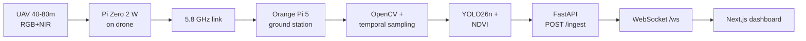

# BAGWIS Manuscript — AI Context Guide

This document tells **Claude, Cursor Agent, Composer, and other AI assistants** how to read and apply information from the BAGWIS thesis manuscript when working on `nextjs-drone-dashboard` and related backend/edge code.

**Primary source:** `[FINAL] BAGWIS - RESEARCH.pdf` (Downloads or copy into repo)  
**Authors:** Bañez, Cosare, Gan, Mistal — PUP Computer Engineering, May 2026  
**Companion implementation spec:** `dashboard_output_integration_*.plan.md` (if present in Downloads or `docs/`)

---

## 1. What AI can and cannot “understand”

| Source | How AI gets it | Reliability |
|--------|----------------|-------------|
| **This file** (`docs/MANUSCRIPT-AI-CONTEXT.md`) | In workspace; always preferred | Highest — structured, implementation-oriented |
| **PDF attached with `@`** | Model reads extracted text | High if attached each session |
| **PDF path outside workspace** | May work via absolute path; not guaranteed in all modes | Medium — re-attach when switching agents |
| **Prior chat messages** | Same thread only | Medium — may be summarized or truncated |
| **New chat / toggled subagent** | No automatic memory | Low — paste summary or `@` files again |

**Rule for the team:** Treat the manuscript as **requirements**, not as automatically loaded memory. For every new Agent/Composer session, use:

```text
Follow docs/MANUSCRIPT-AI-CONTEXT.md and @docs/MANUSCRIPT-AI-CONTEXT.md.
Implement only what aligns with the BAGWIS thesis scope (Marikina River, 2 km, five classes).
```

---

## 2. One-paragraph system summary (paste into any agent)

**BAGWIS** (Blockage and Aerial Geospatial Waterway Intelligence System) is a Marikina River UAV monitoring system. A multirotor flies a **2 km** corridor at **40–80 m**, **VLOS**, ~**5.35 m/s**. **RGB + NIR** video is sent from the drone (**Raspberry Pi Zero 2 W**) to the **Orange Pi 5 ground station** over a **5.8 GHz** link. The ground station runs **OpenCV** (fisheye correction, temporal frame sampling), **YOLO26n** (five obstruction classes), **NDVI** (hyacinth), and **GSD-based** metrics (area m², volume m³, truck loads, wet biomass kg, **RWOR** %). Results update **orthomosaic**, **KDE heatmaps**, and a **web dashboard** for **RPA**, **CEMO**, and **MDRRMO**. Evaluation uses **ISO 25010** (software), **ISO 21384-2** (UAS hardware), and **TAM** (LGU adoption).

---

## 3. Manuscript map → what to implement

Use this table so agents read the **right chapter** for each task.

| Manuscript section | Content | Use when AI should… |
|--------------------|---------|---------------------|
| **Ch. 1 — Definition of Terms** | Operational definitions (NDVI, KDE, RWOR, dynamic mapping, edge-AI) | Name UI labels, tooltips, API field descriptions |
| **Ch. 1 — Scope & Limitations** | 2 km segment, 15–20 flight days, 30 min max flight, weather, CAAP rules | Avoid out-of-scope features (nationwide map, night ops, cloud-only inference) |
| **Ch. 2 — Literature** | Background only | **Do not** implement; cite if writing thesis text |
| **Ch. 3 — Process Flowchart** | Closed-loop flight → inference → dashboard → RTL | Backend ingest timing, mission state machine, WebSocket events |
| **Ch. 3 — Table 1 (dataset classes)** | YOLO class IDs 0–4 | `DetectionCategory` enums, legend colors, model labels |
| **Ch. 3 — Table 2 (analytical outputs)** | Formulas for heatmap, area, volume, trucks, biomass, RWOR | Dashboard metrics, DB columns, CSV/KML fields |
| **Ch. 3 — Table 3 (materials)** | Hardware bill of materials | Hardware docs only — not Next.js UI |
| **Ch. 3 — Design Project Flow (Phases 0–5)** | Agile phases | Project planning, not runtime code |
| **Ch. 3 — YOLO26 / dataset pipeline** | Training, RKNN export | Edge/ML repo — not dashboard unless displaying metrics |

**Chapters on evaluation (ISO/TAM):** relevant for **survey instruments and thesis write-up**, not for dashboard React components unless building an admin/evaluation module (out of scope unless requested).

---

## 4. Canonical glossary (thesis → code)

AI should translate thesis language into stable code names:

| Thesis term | Meaning | Suggested code / API name |
|-------------|---------|---------------------------|
| Water hyacinth | *Eichhornia crassipes*, class 0 | `hyacinth` |
| PET / rigid plastics | Class 1 | `pet` |
| Soft plastics / nylon | Class 2 | `soft-plastic` |
| Styrofoam / EPS | Class 3 | `eps` |
| Organic debris (logs/branches) | Class 4 | `wood` (UI label may say “Organic debris”) |
| Dynamic mapping | Live dashboard updates during flight | WebSocket `detection` + `telemetry` messages |
| KDE heatmap | 2D kernel density on georeferenced boxes | `MapHeatmapPanel` KDE mode |
| Orthomosaic | Stitched georeferenced basemap | Map base layer / tile overlay |
| GSD | Ground sample distance (m/pixel) | `gsdMPerPx` (internal); drives area/volume |
| RWOR | River width obstruction ratio (%) | `riverWidthObstructionPct` |
| Wet biomass | kg for hyacinth only | `biomassKg` or `wetBiomassKg` |
| Truck load (TL) | `volume_m3 / 6` (6 m³ truck) | `estimatedTrucks` |
| Edge-AI | Inference on Orange Pi 5 NPU | Ground station Python, not browser |
| Georeference | GPS + detection merge | `lat`, `lng` on each `DetectionEntry` |
| RTL | Return to launch | `flightMode: "RTL"` |

---

## 5. Detection classes (authoritative)

From **Table 1 — Dataset Class Selection**:

| Class ID | Thesis label | Dashboard category key |
|----------|--------------|------------------------|
| 0 | Water hyacinth | `hyacinth` |
| 1 | PET / rigid plastics | `pet` |
| 2 | Soft plastics / nylon | `soft-plastic` |
| 3 | Styrofoam / EPS | `eps` |
| 4 | Organic debris (logs/branches) | `wood` |

**Segmentation** (PASCAL VOC) uses separate class IDs for background/hyacinth/void — do not confuse with detection IDs above.

---

## 6. Analytical outputs (Table 2) — implement on dashboard

These are **required user-visible metrics**, not optional decorations.

| # | Output | Formula (thesis) | Primary stakeholder |
|---|--------|------------------|---------------------|
| 1 | Orthomosaic base layer | OpenCV stitch + MAVLink GPS | RPA |
| 2 | Dynamic risk heatmap | 2D weighted **KDE** on `(Xi, Yi)` from YOLO boxes | RPA, CEMO, MCDRRMO |
| 3 | Surface area (m²) | `Area = Px × GSD²` | CEMO |
| 4 | Volume (m³) | `Volume = Area × Davg` (e.g. Davg ≈ 0.15 m) | CEMO |
| 5 | Truck loads | `TL = Volume / Vtruck` (Vtruck = **6 m³**) | CEMO |
| 6 | Wet biomass (kg) | `Biomass = Area × WDensity` (15–22 kg/m² hyacinth) | RPA |
| 7 | RWOR (%) | `(W_cluster / W_river) × 100` | MCDRRMO |

**Important thesis constraint:** Inorganic waste uses **spatial/volumetric** metrics only — **no wet-weight** for plastics/wood.

---

## 7. Runtime architecture (what Claude should assume)

Authoritative flow from **Ch. 3 Process Flowchart**:



**Do not conflate:**

- **Drone:** flight controller (SpeedyBee F405), GPS (Matek M10Q), cameras, **Pi Zero** (video uplink).
- **Ground:** **Orange Pi 5** runs inference pipeline and hosts/serves the LGU dashboard (per Table 3).
- **Browser:** read-only + export; no YOLO on the client.

If a diagram in another doc places Orange Pi on the drone, prefer **this process flowchart** unless the user explicitly overrides.

### Flight loop (logic)

1. Upload waypoints (Mission Planner) → AUTO mission, **2 km**.
2. Cruise at **40–80 m**, ~**5.35 m/s**.
3. Ground station: dynamic frame interval = `FOV_length / ground_speed` (non-overlapping footprints).
4. On detection: classify → area → (volume, trucks **or** biomass, RWOR) → georeference → push to **KDE + orthomosaic + dashboard**.
5. At final waypoint → **RTL**.

---

## 8. Stakeholders and dashboard roles

| Organization | Role | Dashboard needs |
|--------------|------|-----------------|
| **RPA** (River Parks Authority) | Primary — maintenance, orthomosaic, coordinates | Maps, hyacinth biomass, cleanup coordinates |
| **CEMO** | Primary — waste logistics | Area, volume, **truck counts**, hotspots |
| **MCDRRMO** | Secondary — flood risk | **RWOR**, KDE severity, export for GIS |
| **Researchers** | Development / evaluation | Not end-user UI |

Planned auth (integration plan): `admin` (full + export), `viewer` (CEMO/MDRRMO read-only).

---

## 9. Scope boundaries (agents must not violate)

From **Scope and Limitations** — treat as hard requirements:

- **Geography:** 2 km Marikina River segments only (two segments in study design).
- **Altitude:** 40–80 m (below CAAP 122 m ceiling).
- **Flight:** VLOS, daytime only, clear weather, wind &lt; 8 m/s, max ~30 min per sortie.
- **No** cloud-dependent inference for operational demo.
- **No** wet-weight estimates for inorganic waste.
- **Academic prototype** — not commercial CAAP-licensed operations; still follow Part 11 safety framing in docs.

---

## 10. How this repo relates to the manuscript

| Repo area | Manuscript alignment | Status (typical) |
|-----------|----------------------|------------------|
| `app/components/dashboard/DashboardClient.tsx` | Shell for “dynamic mapping” UI | Mock telemetry |
| `app/components/dashboard/heatmap-data.ts` | Stand-in for KDE hotspots | Mock — replace with WS data |
| `app/components/dashboard/types.ts` | `HeatmapPoint` only | Extend per `DetectionEntry`, `MissionStatus` |
| `app/components/dashboard/MapHeatmapPanel.tsx` | Orthomosaic + heatmap views | Needs KDE mode |
| `app/components/dashboard/DroneViewFrame.tsx` | “Software view” / AI feed | Placeholder scene |
| `backend/` (planned) | Ground station API | Not in repo yet |

When implementing, **keep mock data as fallback** when WebSocket is disconnected (demo mode), as specified in the integration plan.

---

## 11. Shared types agents should implement

Align TypeScript and Python with thesis + integration plan:

```typescript
// Target shape — app/components/dashboard/types.ts
export type DetectionCategory =
  | "hyacinth"
  | "pet"
  | "soft-plastic"
  | "eps"
  | "wood";

export type DetectionEntry = {
  id: string;
  missionId: string;
  timestamp: string; // ISO 8601
  lat: number;
  lng: number;
  category: DetectionCategory;
  confidence: number; // 0–1
  ndvi: number; // -1 to +1, hyacinth-relevant
  biomassDensity: number; // kg/m² (organic)
  obstructionArea: number; // m²
  volumeM3?: number; // inorganic
  estimatedTrucks?: number; // inorganic
  rworPct?: number; // flood metric
};

export type MissionStatus = {
  missionId: string;
  altitudeM: number;
  gpsLat: number;
  gpsLng: number;
  batteryPct: number;
  waypointCurrent: number;
  waypointTotal: number;
  flightMode: "AUTO" | "RTL" | "HOLD" | "MANUAL";
  elapsedSeconds: number;
};
```

---

## 12. Orange Pi → ground ingest (reference payload)

Agents implementing `/ingest` should accept fields consistent with thesis metrics:

```json
{
  "mission_id": "flight-001",
  "lat": 14.6302,
  "lng": 121.0965,
  "category": "hyacinth",
  "confidence": 0.91,
  "ndvi": 0.63,
  "biomass_density": 4.2,
  "obstruction_area_m2": 85.0,
  "volume_m3": 12.5,
  "estimated_trucks": 2,
  "rwor_pct": 18.5,
  "altitude_m": 55,
  "battery_pct": 72,
  "waypoint_current": 4,
  "waypoint_total": 12,
  "flight_mode": "AUTO"
}
```

Auth: **`X-Api-Key`** for drone/edge → server; **JWT** for browser → server.

---

## 13. Prompt templates for Composer / Agent

### Full-stack feature

```text
Read docs/MANUSCRIPT-AI-CONTEXT.md. Implement [FEATURE] for BAGWIS dashboard.
Constraints: five detection classes, Table 2 metrics, Marikina 2 km scope.
Match existing Tailwind dashboard patterns in app/components/dashboard/.
```

### UI-only

```text
@docs/MANUSCRIPT-AI-CONTEXT.md
Add DetectionSummaryPanel: per-category counts from DetectionEntry[].
Labels must match thesis Table 1 (hyacinth, PET, soft plastics, EPS, organic debris).
```

### Backend

```text
@docs/MANUSCRIPT-AI-CONTEXT.md
Scaffold FastAPI POST /ingest and WebSocket /ws per Section 7.
Persist Table 2 fields; broadcast WsMessage types telemetry | detection | mission_end.
```

### Handoff when toggling agents

```text
Continue BAGWIS work. Context: docs/MANUSCRIPT-AI-CONTEXT.md.
Done: [list]. Next: [task]. Do not expand scope beyond thesis Ch.1 limitations.
```

---

## 14. Common misunderstandings (correct the model)

| Wrong assumption | Correct per manuscript |
|------------------|------------------------|
| “YOLO runs in the browser” | Inference on **Orange Pi 5** ground station |
| “Satellite imagery drives live UI” | Live UI is **UAV + edge**; satellite cited as inadequate for latency |
| “All waste types get biomass kg” | **Biomass kg only for hyacinth**; inorganic uses m² / m³ / trucks |
| “Any global river” | **Marikina River** 2 km segments only |
| “Cloud API required” | **Edge/off-grid** operation is a design goal |
| “CCTV replacement module” | System is **mobile UAV mapping**, not fixed CCTV |
| Class name `plastic` generic | Use **five specific classes** from Table 1 |

---

## 15. Evaluation frameworks (reference only)

Include in thesis/documentation tasks, **not** default dashboard features:

- **ISO/IEC 25010** — software quality (functional suitability, usability, reliability)
- **ISO 21384-2** — UAS hardware design
- **TAM** — perceived usefulness & ease of use for RPA/CEMO

---

## 16. Maintaining this document

Update when:

- PDF manuscript revision changes Table 1/2 or process flow
- Integration plan adds/removes API fields
- Repo gains `backend/` or real `types.ts` contracts

**Suggested copy step:** Place `[FINAL] BAGWIS - RESEARCH.pdf` in `docs/source/` (optional) so `@docs/source/...` works in Cursor without Downloads path.

---

## 17. Quick checklist before merging AI-generated code

- [ ] Five detection categories with correct IDs/labels  
- [ ] Table 2 metrics exposed where relevant (not all on every panel)  
- [ ] Hyacinth vs inorganic metric split respected  
- [ ] Marikina / 2 km / flight constraints reflected in copy or config  
- [ ] Mock fallback when WebSocket offline  
- [ ] No cloud-only dependency for core demo path  
- [ ] RTL and AUTO flight modes supported in mission status  

---

*Last aligned with: `[FINAL] BAGWIS - RESEARCH.pdf` (May 2026 draft, 95 pages) and dashboard integration plan.*
